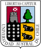

# Tesina de Titulación ESOD299 
Bienvenidos al repositorio de ESOD299. Aquí encontrará todos los documentos y enlaces necesarios para cursar la asignatura.

### 📓 Programa de la asignatura

El programa está disponible [aquí](Programa_de_Asignatura(DACIC2018).pdf).

### 📕 Manual de procedimiento y reglamentos
Puede encontrar toda la información de la asignatura en el [manual de procedimiento y reglamentos](manual.md).
Considérelo una guía de ruta, y una lectura obligatoria.

### 📄 Formatos

El formato para el protocolo y las 2 versiones del manuscrito final están en la carpeta `/formatos`.

¿No tiene claro por qué son 2 versiones del manuscrito? Entonces no ha leído completamente el [manual de procedimiento y reglamentos](manual.md).

### 📝 Rúbricas y pautas de evaluación

Todas las rúbricas y pautas con las que será evaluado durante el año están en la carpeta de `/rubricas`.

### 📅 Fechas importantes
Todas las fechas aparecen en el [manual de la asingatura](https://github.com/diegohalabi/ESOD299/blob/master/manual.md#instrucciones-fechas-y-consultas-frecuentes).

### 📍 Lugar
Puede ubicarme en la [Escuela de Odontología](https://goo.gl/maps/dgvnZqpLpuB2), en el Campus Isla Teja, de lunes a viernes en horario de oficina.
Si quiere asegurar su cita, esribirme a diego.halabi[at]uach.cl, ya que paso gran parte de mi tiempo en el [Lab](http://cisne.uach.cl).

El examen de calificación, al igual que los avances, se realizarán en el mismo lugar.

### 🎓 Tesis de otros años

En la web de Biblioteca existe un repositorio con todas las tesis y tesinas finalizadas hasta la fecha, puede ingresar [aquí](http://catalogobiblioteca.uach.cl:8080/ipac20/ipac.jsp?session=154I5WU225233.244506&profile=bibteja&uri=link=3100006~!91389~!3100001~!3100002&aspect=subtab14&menu=search&ri=4&source=~!biblioteca&term=ODONTOLOGIA&index=SUBJECT).

### 👀 Tutoriales y material de estudio
Internet está lleno de tutoriales!
Yo he desarrollado material de estudio disponible en /`tutoriales`, mi [blog](diegohalabi.github.io) o mi [GitHub](github.com/diegohalabi). Puede navegar libremente y aprender sin compromisos.
